# 迷宫搜索算法实验

一个基于 Python + tkinter 的迷宫智能体程序，支持随机地图生成、手动搜索和多种自动搜索算法的可视化演示。

## 功能介绍

- **自动构建地图**：程序可自动生成迷宫地图文件（`.map`），也可读取已有地图文件。地图格式：`1` 表示墙，`0` 表示通路，`@` 表示起点，`$` 表示终点，地图尺寸 50×50 以上，道路和墙的宽度均为一个单位（方格）。
- **手动搜索**：通过键盘上下左右箭头键控制智能体（Agent）在迷宫中移动，墙壁阻挡不可穿越。
- **自动搜索**：支持五种搜索策略，动态展示搜索路径并显示路程代价（每格消耗 1）：
  - 深度优先搜索（DFS）
  - 宽度优先搜索（BFS）
  - 一致代价搜索（UCS）
  - 贪心搜索（Greedy）
  - A\* 搜索（A-Star）
- **变速控制**：可调整自动搜索的画布刷新间隔，控制搜索动画速度。

## 运行环境

- Python 3.x
- 依赖库：`tkinter`（Python 内置）、`numpy`、`heapq`（内置）

安装依赖：

```bash
pip install numpy
```

## 运行方式

```bash
python map.py
```

> **注意**：程序运行时会在当前工作目录下自动创建 `map/` 文件夹，并在首次运行时自动生成一张随机地图。

## 地图文件格式

地图以纯文本（UTF-8 编码）存储，元素之间用逗号分隔：

```
1,1,1,1,1,1,...
1,@,0,0,1,...
1,1,1,0,1,...
...
1,0,0,$,1,...
1,1,1,1,1,...
```

| 符号 | 含义 |
|------|------|
| `1`  | 墙   |
| `0`  | 通路 |
| `@`  | 起点 |
| `$`  | 终点 |

图1 与图2 分别展示了地图文件格式和地图的显示效果：

<p align="center">
  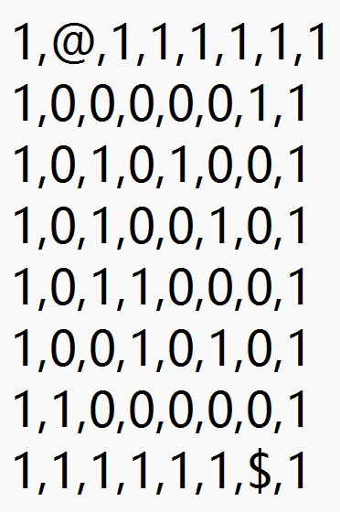
  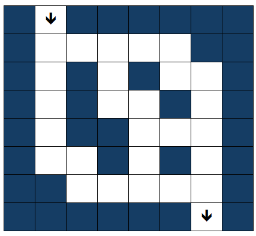
</p>
<p align="center"><em>图1 地图文件格式　　图2 地图显示格式（示例）</em></p>

## 界面说明

程序窗口左侧为功能菜单，右侧为迷宫地图画布。

- 地图颜色：蓝色为通路，黄色为墙，红色为智能体，绿色为终点。
- **生成地图**：随机生成一张新地图并自动打开。
- **打开地图**：在右侧下拉列表中选择地图文件，再点击"打开地图"加载。
- **变速**：在输入框填入间隔时间（单位：秒，越小越快），点击"变速"生效。
- **路程消耗**：显示当前搜索所经过的路径长度。

> 窗口大小固定不可调整；地图尺寸、颜色等参数均可在源码中直接修改。

## 效果展示

### 基本界面

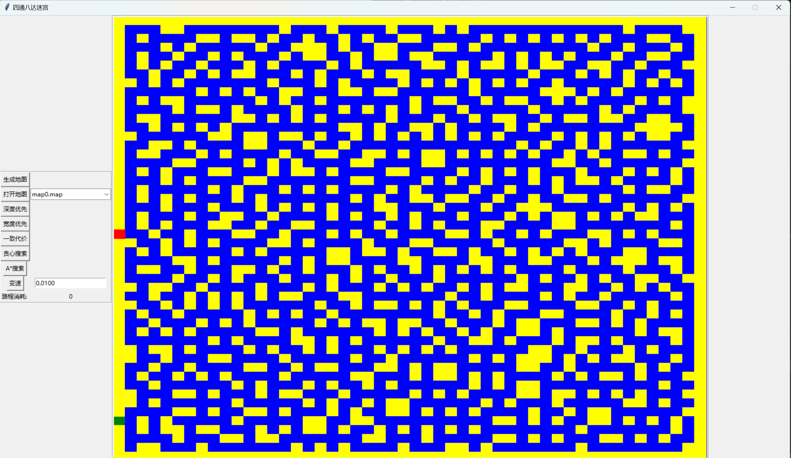

---

### 手动搜索

使用键盘方向键控制智能体（红色方块）在迷宫中移动，抵达绿色终点即完成。

---

### 自动搜索说明

点击左侧相应搜索按钮后，画布会动态显示智能体移动位置及路程消耗的更新。到达终点后，除深度优先外，其余算法会清除多余路径、仅保留从起点到终点的最优路径，并弹出提示框。

> 请勿在搜索过程中点击"生成地图"、"打开地图"或其他搜索按钮，否则会导致画面混乱（等待本次搜索结束后会自动恢复正常）。

---

### 深度优先搜索（DFS）

搜索结果受起点与终点的相对位置以及方向选取顺序影响较大。

<p align="center">
  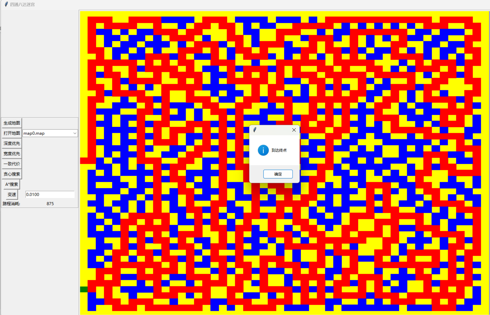
  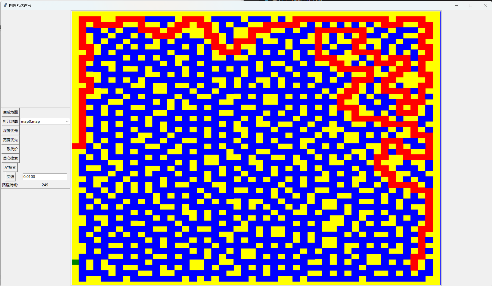
</p>
<p align="center"><em>搜索过程　　搜索结果（路程代价：875）</em></p>

---

### 宽度优先搜索（BFS）

如洪水蔓延一般，逐层向外扩展，保证找到最短路径。

<p align="center">
  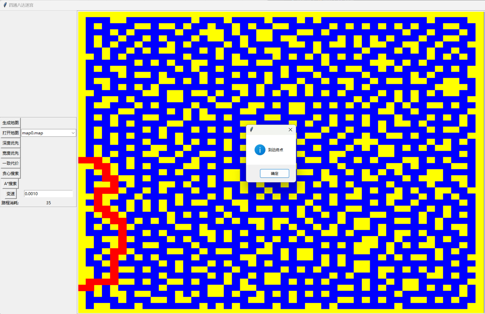
  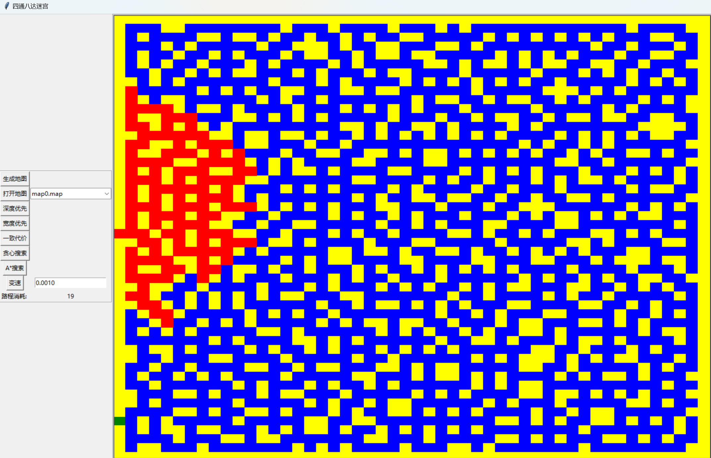
</p>
<p align="center"><em>搜索过程　　搜索结果（路程代价：35）</em></p>

---

### 一致代价搜索（UCS）

每前进一格代价加一，每次选取代价最小的节点扩展。由于代价设置，实际搜索过程类似 BFS，但得到的最终路径与 BFS 结果相同。

<p align="center">
  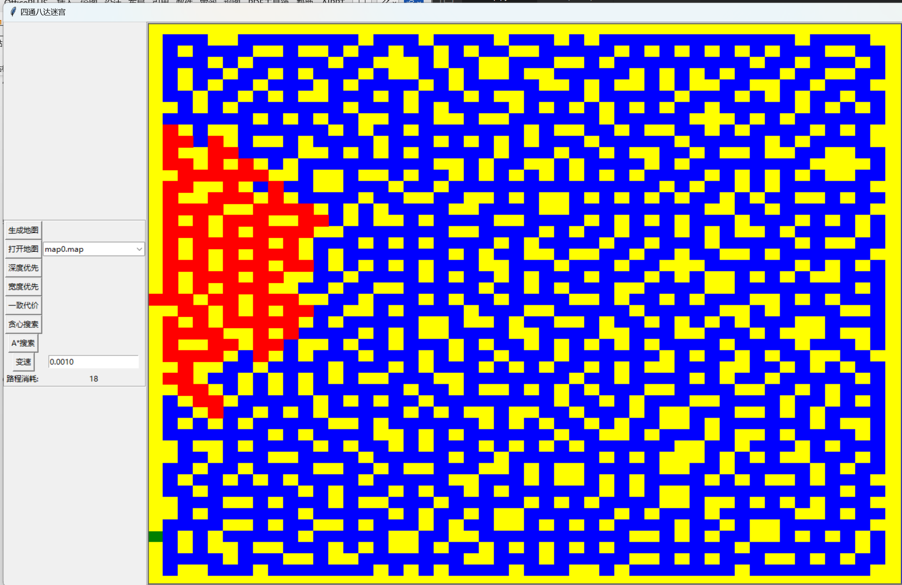
  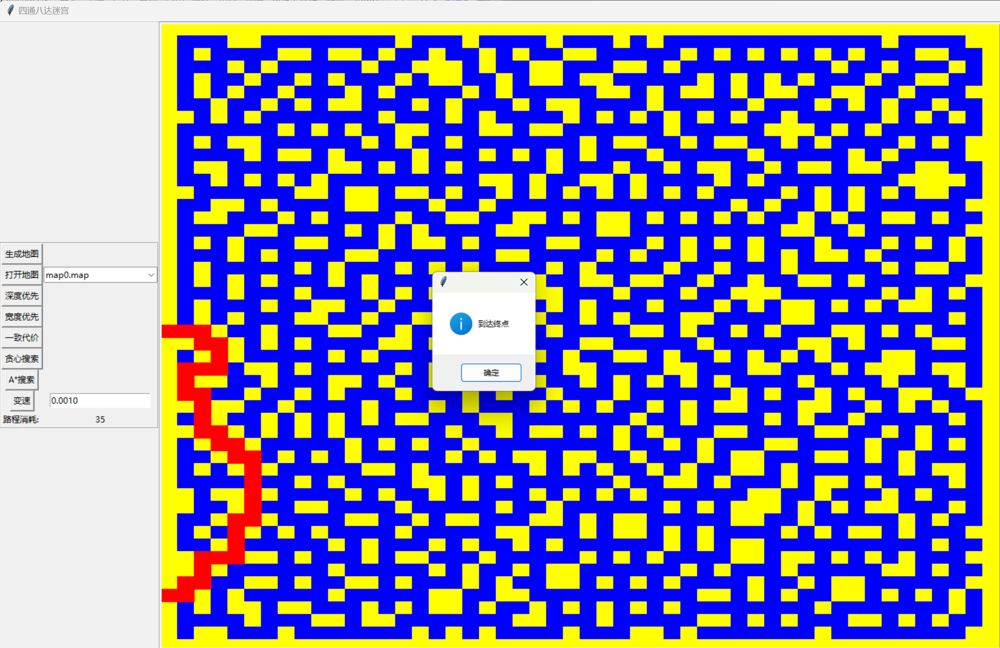
</p>
<p align="center"><em>搜索过程　　搜索结果（路程代价：35）</em></p>

---

### 贪心搜索（Greedy）

使用曼哈顿距离作为启发函数，每次选取距终点预估距离最小的节点扩展，速度较快但不保证最优路径。

<p align="center">
  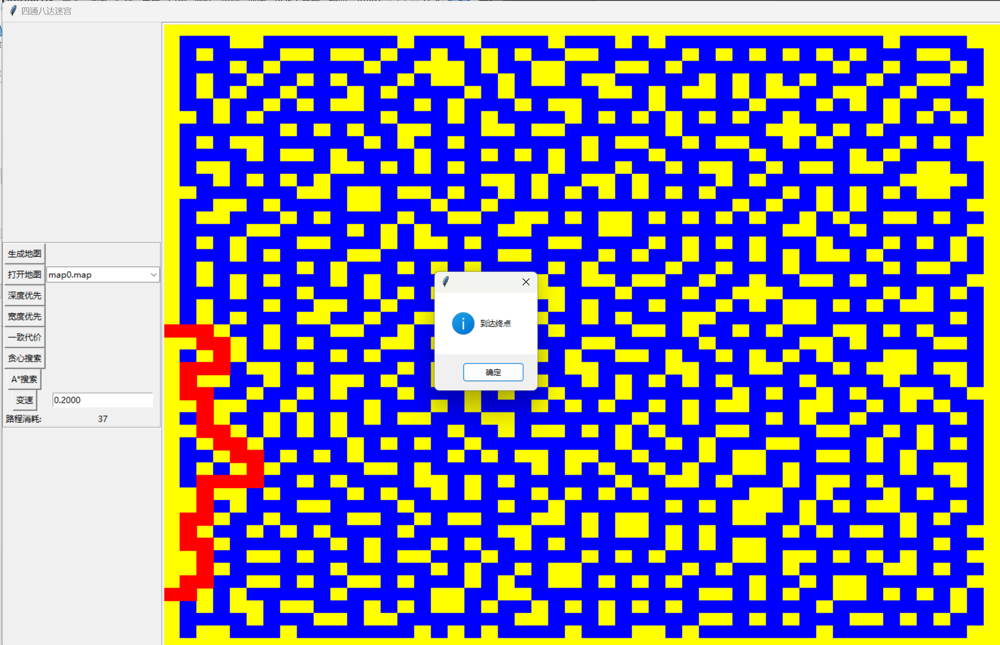
  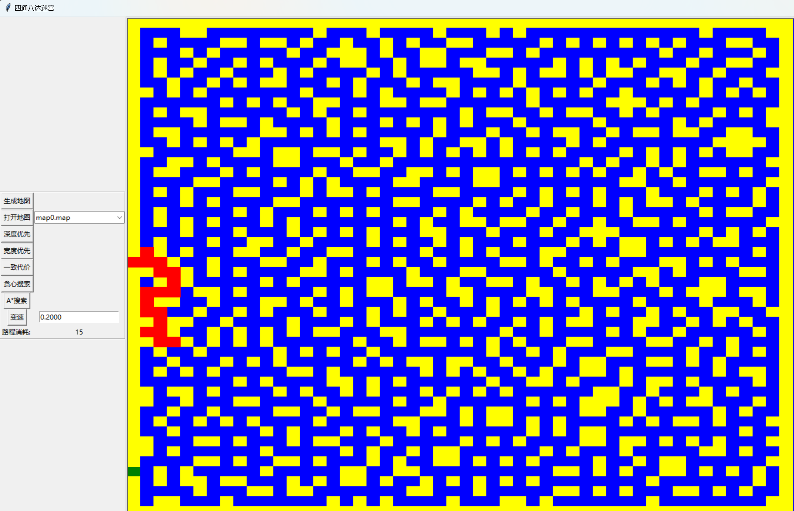
</p>
<p align="center"><em>搜索结果（路程代价：37）　　搜索过程（降速截屏）</em></p>

---

### A\* 搜索

综合当前路径代价 g(n) 与曼哈顿距离启发值 h(n)，以 f(n) = g(n) + h(n) 为优先级，兼顾效率与最优性。

<p align="center">
  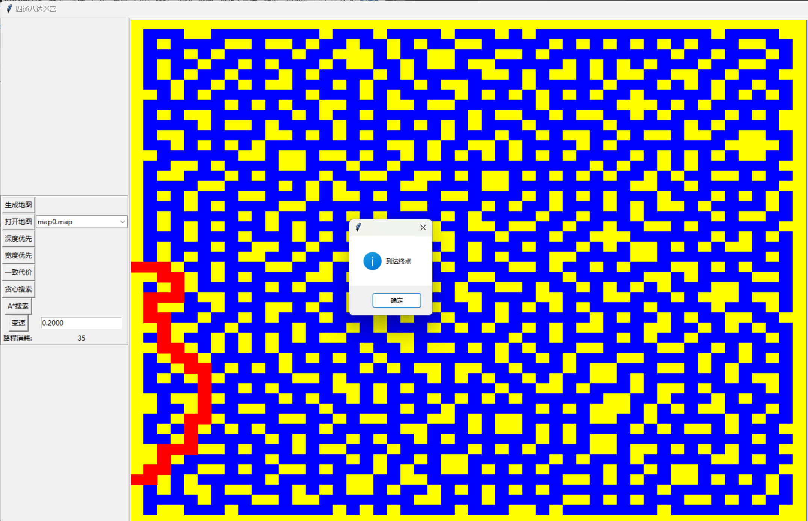
  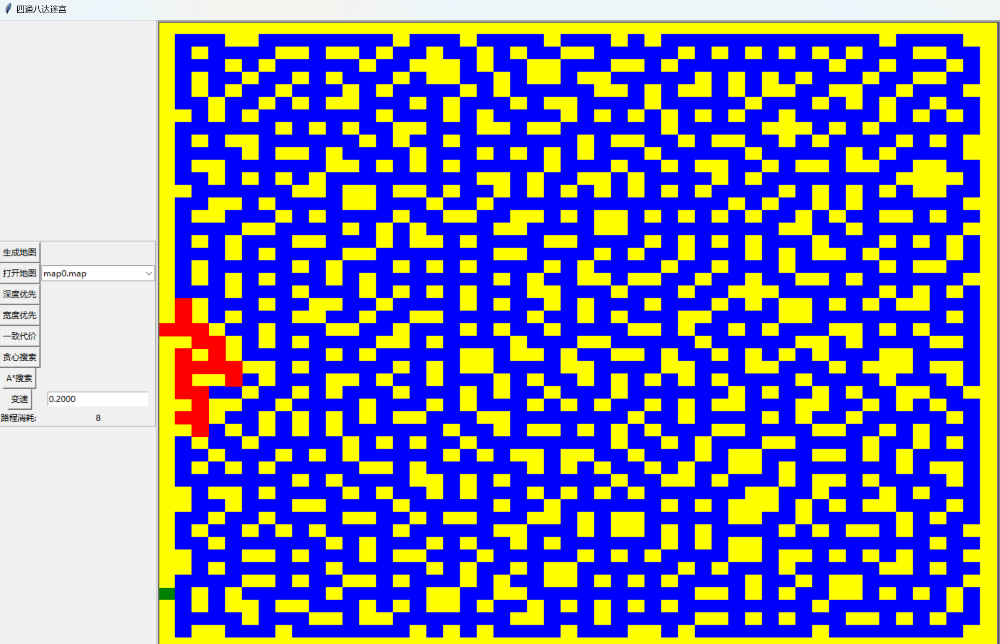
</p>
<p align="center"><em>搜索结果（路程代价：35）　　搜索过程</em></p>

将智能体手动移至迷宫中心后再执行 A\* 搜索的效果：

<p align="center">
  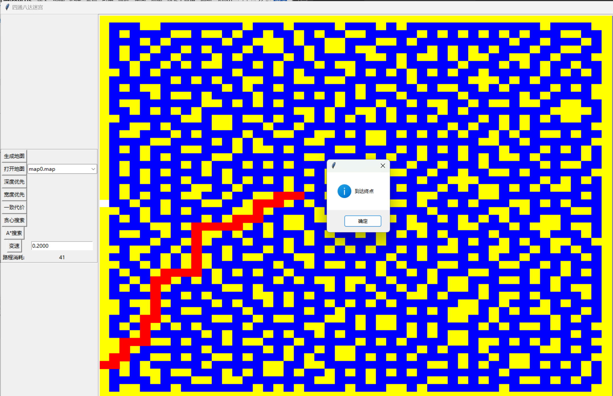
</p>
<p align="center"><em>Agent 手动移至中心后再进行 A* 搜索</em></p>

> 提示：到达终点弹出提示框时，可将对话框拖开以查看完整路径。

## 算法说明

| 算法 | 策略 | 最优性 | 特点 |
|------|------|--------|------|
| 深度优先（DFS） | 递归，按上→右→下→左顺序 | 否 | 路径较长，受方向顺序影响大 |
| 宽度优先（BFS） | 队列，逐层扩展 | 是（等代价） | 保证最短路径 |
| 一致代价（UCS） | 优先队列，代价最小优先 | 是 | 等代价时与 BFS 等价 |
| 贪心搜索 | 优先队列，启发值最小优先 | 否 | 速度快，但路径可能非最优 |
| A\* 搜索 | 优先队列，f = g + h 最小优先 | 是（可接受启发） | 综合效率与最优性 |

## 项目结构

```
.
├── map.py          # 主程序（地图生成 + GUI + 搜索算法）
├── map/            # 地图文件目录（运行时自动生成）
│   └── *.map
└── images/         # 效果截图
```
